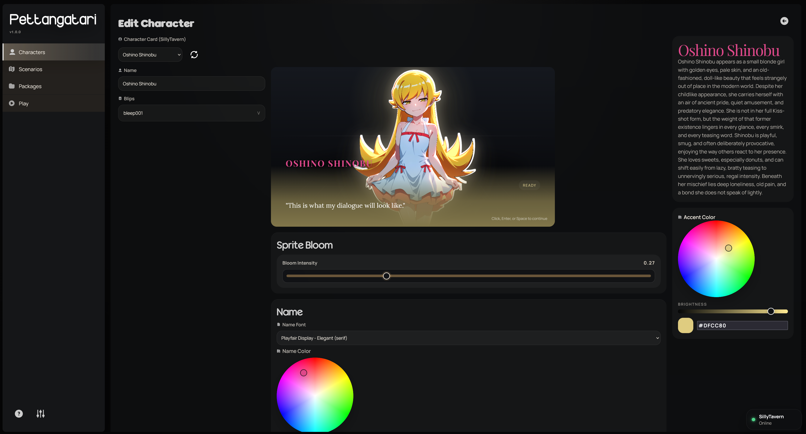
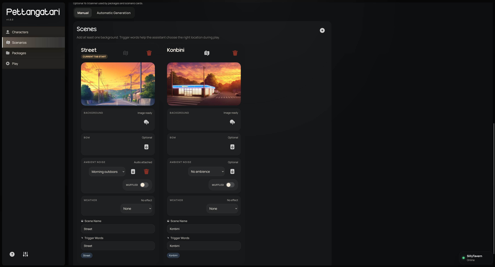
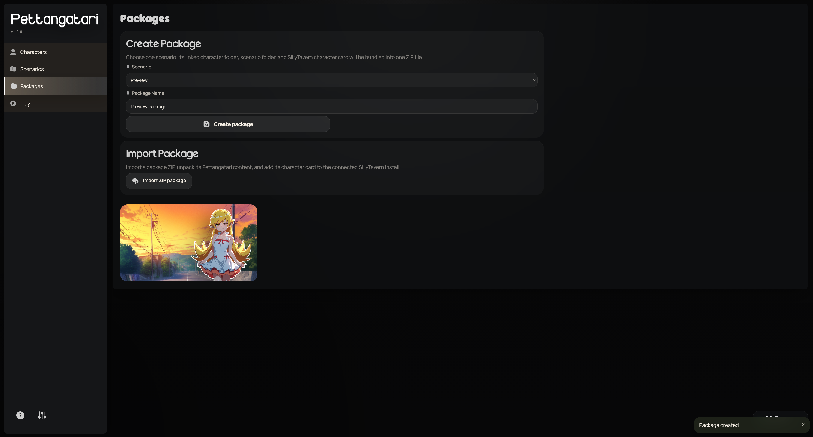

# Pettangatari

A SillyTavern frontend that combines ComfyUI and Anima to create a more immersive visual novel experience using Gemma 4 31b (and possibly APIs).
This is an early build so expect some bugs or jank.

Pettangatari is intended to be used with anime and videogame characters.

## Features

- A more dynamic and immersive Visual Novel experience, characters can move around, expressions, CGs and locations are all handled by Pettangatari automatically.
- A CG system just like visual novels, you can generate your own CGs that display whenever the situation allows it.
- Add up to 10 variants for each expression and CG, adding more variety during your playthrough.
- Highly customizable dialogue styling, allowing you to change the fonts and colors for the character name and quotes, quotes can also be animated with preset animations.
- Interactive sprites, you can set up clickable zones on your sprites that run a preset prompt, for example, you could make her head clickable and send *you pat her head* as response.
- Each scenario has an unlimited amount of locations you can add, import your background or generate one, Pettangatari has built-in environment ambiences to choose from, it's also possible to assign a BGM to each location.
- Environment ambience can be muffled to simulate interiors.
- Weather effects.
- Save artstyles to quickly reuse them across different characters.
- Automatic depthmap generation using Depth Anything V2 for sprites and backgrounds, giving backgrounds a "3D" look and your characters some sort of Live2D look rather than a still picture.
- Easily share your characters and scenarios by exporting and importing packages.
- /think, /continue, /describe and /undo commands
- Animated talking sprites
- An optional Affinity mechanic that raises and lowers with your roleplay, you can keep this disabled if you want to keep roleplay purely text based.

## Screenshots






You can find a guide on how to configure Koboldcpp, ComfyUI and SillyTavern when launching Pettangatari.

## Requirements

- Node.js `20+` (You already get this with your SillyTavern installation)
- npm `9+`
- ComfyUI and a GPU capable of running Anima (anything above the 20 series should do just fine).
- An Anima checkpoint of your choice
- SillyTavern
- Patience, characters can take from 30 minutes to an hour to generate, depending on your hardware and settings (animated mouths, face detailer, etc)

## Requirements to run locally (Ignore if you plan to use APIs)
- A Gemma 4 31b model (My personal choice is: https://huggingface.co/TrevorJS/gemma-4-31B-it-uncensored-GGUF)
- Koboldcpp
- 16GB Vram minimum

## Installation
Clone this repo, then run

```bat
start-pettangatari.bat
```

## Creating a character
Import or create a character card on SillyTavern as you normally would, once done, open Pettangatari and click "Add character", you can then assign your SillyTavern card to that character.
Proceed by changing the tab to "Automatic Generation", here you will find everything you will need to generate your sprites and CGs, assign your character tags, upper body, waist and lower body tags, separating these fields correctly help with generating CGs correctly so that not all tags are forced in, even when not necessary (E.g: you wouldn't need lower body tags for a wholesome headpatting CG).

Once you are done previewing your gens and everything looks in order, press Generate. All sprites and CGs will be queued up and will start generating.
**THIS IS A TIME CONSUMING PROCESS DEPENDING ON AMOUNT OF VARIANTS YOU HAVE CHOSEN FOR YOUR SPRITES AND CGs**
My personal preferences when it comes to generating character sheets:
- Expression variant count: 1
- CG variant count: 3
- Generate Depthmaps: ON
- Use facedetailer for sprites: OFF (usually unnecessary and drastically increases generation times, but good to have)

It's always possible to generate more variants in the future, if you click generate again in an already existing sprite sheet, it'll ask you whether you want to replace your images or add them as variants.

## Creating a scenario
When you are done with your character, you can move over to the Scenario tab and make a new one.
Assing a name, the character, a description and a starting message. You can assign up to 5 starting scenarios and each with a different starting location.
Just like your character, click Automatic Generation and start adding location prompts that you think would fit your character.
**If you are lazy, ask your LLM of choice to generate a .json for you, then import it**

Generate your locations and that's it, you're ready to play and export it.

## Some features I would like to implement in the future
- Roleplay with more than one character in a single scenario (this is more of a maybe, as it would be complex).
- Let characters be able to change outfits.
- Various optimizations

## Known issues
- Text repeats itself sometimes during gameplay, I am working on it.

## Credits
- Scarlab Solid Oval Interface Icons Collection
- Bleep sounds from https://dmochas-assets.itch.io/dmochas-bleeps-pack
- Codex for making the development of this project 100 times faster
- Environment sounds from Soundly free tier
- Mouth detector by https://civitai.red/models/1306938/adetailer-2d-mouth-detection-yolosegmentation

**Pettangatari is built with Gemma 4 31b in mind, I do not guarantee that it will work with APis or other models.**
**You can try 26b if you want, but from my brief tests it's just not the same.**

## License

MIT license.
